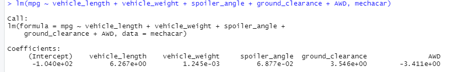
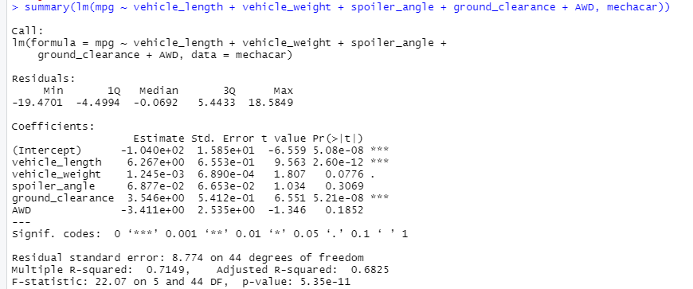
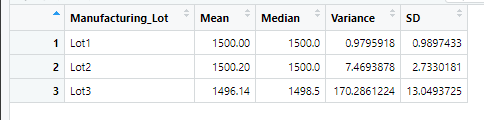
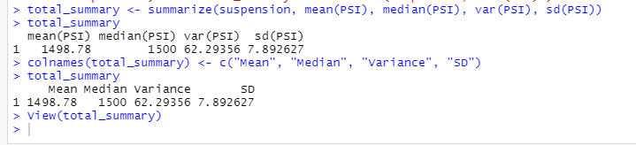
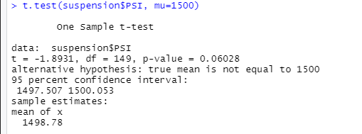
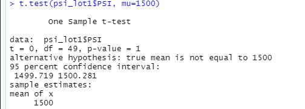
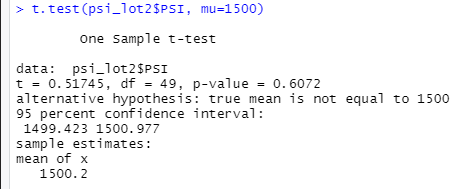
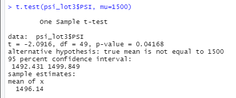

# MechaCar Statistical Analysis

## MechaCar Overview

Using data for a new prototype, the MechaCar, to determine what can be done to help quell troubles in production of the vehicle.

## Linear Regression to Predict MPG

### Linear Regression

### Linear Regression Summary

-Which variables/coefficients provided a non-random amount of variance to the mpg values in the dataset?
 - The Vehicle Weight coefficient provided a non-random amount of variance to the mpg values.

-Is the slope of the linear model considered to be zero? Why or why not?
 - No, because the coefficients vary on both sides, with negative and positive values.

-Does this linear model predict mpg of MechaCar prototypes effectively? Why or why not?
 - No, not enough can be inferred from this data alone.

## Summary Statistics on Suspension Coils

### Lot Summary

The design specifications for the MechaCar suspension coils dictate that the variance of the suspension coils must not exceed 100 pounds per square inch. Does the current manufacturing data meet this design specification for all manufacturing lots in total and each lot individually? Why or why not?

-It does not; most if not all suspension coils from all lots show a PSI over 1000.

## T-Tests on Suspension Coils

### Summary
- None of the means for all lots, and each lot individually match the population mean of 1500. All p-values, except for Lot 3, are greater than 0.05, showing that the data is considered normally distributed. 

### All Lots

### Lot 1

### Lot 2

### Lot 3

## Study Design: MechaCar vs Competition

What metric or metrics are you going to test?
- A statistical study that can quantify how the MechaCar performs against the competition could be to compare the cost of each vehicle. Will the MechaCar or its competition be more affordable?

- If the MechaCar is more affordable to consumers, the competition will lose ground in the selling market.

What is the null hypothesis or alternative hypothesis?
- If both cars are affordable, the competition may sell more.
- If both cars are affordable, the MechCar will sell more because it is new.

What statistical test would you use to test the hypothesis? And why? What data is needed to run the statistical test?
- A statistical test to use to test the hypothesis would be to do the two-sample t-test to compare the cost data of each vehicle. The data needed to run this statistical test would be the sales of each vehicle.
